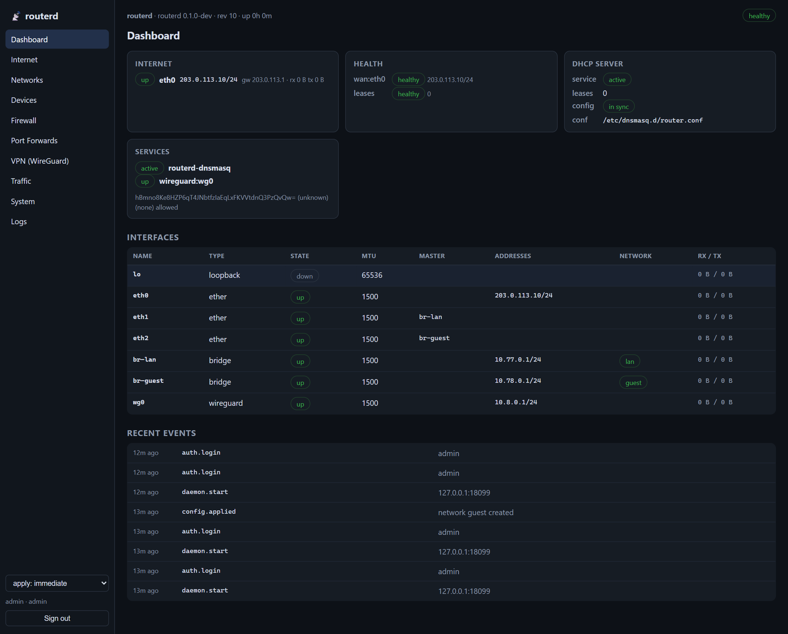
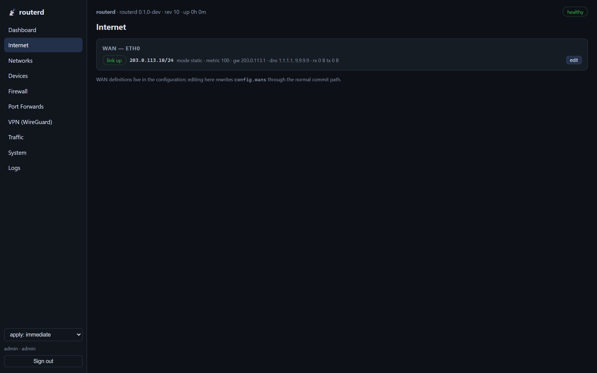
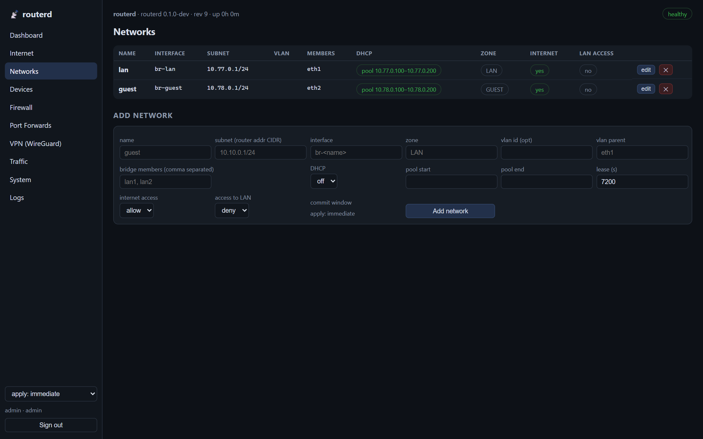
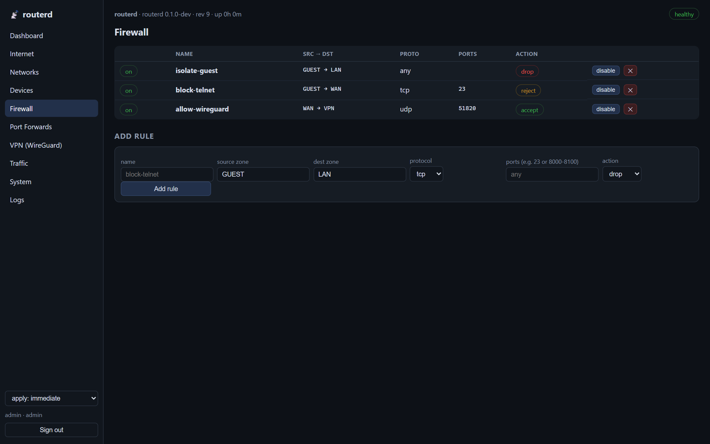
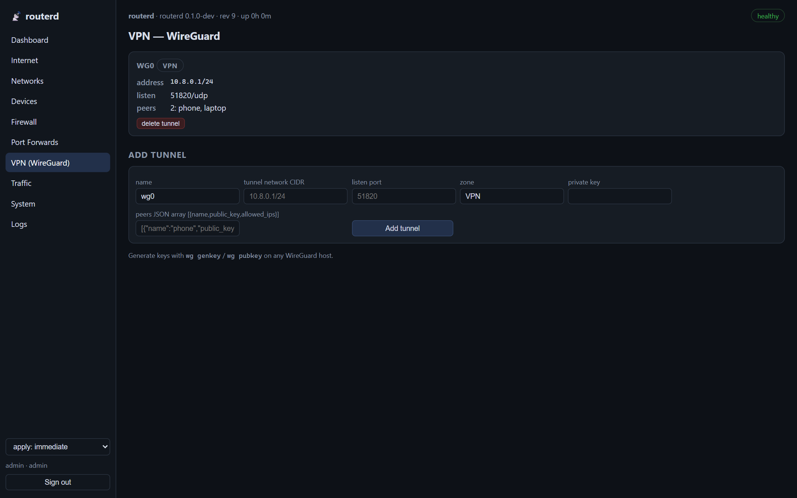
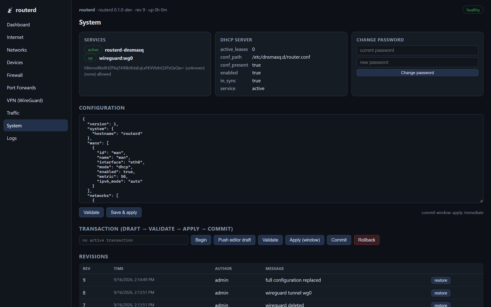

# si-router — Go-Based Consumer-Prosumer Router Platform

MIT licensed — see [LICENSE](LICENSE).

A self-hosted router control plane: a Go daemon (`routerd`) owns the desired
network state and reconciles it against a real Linux data plane (iproute2,
nftables, tc, dnsmasq, WireGuard). Everything is driven through one versioned
REST API, consumed by three frontends: a **web UI** (embedded in the binary),
a **CLI** (`routerctl`), and any script speaking HTTP.

## Components

| Path | Description |
|---|---|
| `router/cmd/routerd` | Daemon: HTTPS REST API + reconciliation engine + Linux apply |
| `router/cmd/routerctl` | CLI client (login, networks, firewall, portfwd, wireguard, transactions, …) |
| `router/web` | Embedded single-page admin UI — no JS build chain, `go:embed`, served at `/` |
| `router/internal/reconcile` | Observe → plan → apply → verify engine (links, addrs, routes, firewall, services, QoS) |
| `router/internal/platform` | Executor abstraction: real `Linux` backend + `Fake` simulated Linux for tests |
| `router/internal/firewall` | Deterministic nftables ruleset generator (zone sets, chain-comment drift marker) |
| `router/internal/dhcp` | dnsmasq config generator + dedicated `routerd-dnsmasq.service` unit |
| `router/internal/dhcp4` | Native WAN DHCPv4 client: BOOTP codec, full state machine, raw-UDP Linux transport, lease registry |
| `router/internal/wireguard` | `wg syncconf` generation (keys write-only via API) |
| `router/internal/qos` | tc (cake/fq_codel/tbf) bandwidth policy planner |
| `router/internal/api` | REST API: RBAC, sessions/API tokens, confirmed commits, transactions, audit, events, metrics |
| `router/internal/store` | Revisioned config persistence + audit log + event bus |
| `router/internal/monitor` | WAN status, device inventory (leases + ARP/NDP + aliases), health checks |
| `router/pkg/models` | Configuration model + validation |
| `install.sh` | Linux installer: systemd unit for `routerd`, `routerctl` into `/usr/local/bin`, dnsmasq dependency, uninstall/purge |
| `Go-Based Consumer-Prosumer Router Platform — System Design.md` | Original system design document |

## Install (Linux router)

```sh
curl -fsSL https://raw.githubusercontent.com/bwangbos/si-router-test-win-med/main/install.sh | sudo bash
# or from a checkout:
sudo bash install.sh                 # clone + build + systemd unit + CLI
sudo bash install.sh --listen 192.168.1.1:8443 --no-enable
sudo bash install.sh --from . --no-deps   # prebuilt binaries, own packages
sudo bash install.sh --uninstall --purge
```

Installs `routerd` (systemd service, state in `/var/lib/routerd`) and
`routerctl` to `/usr/local/bin`. On apt systems (Debian 13, Ubuntu, …) it
also installs every runtime dependency — `iproute2`, `nftables`,
`wireguard-tools`, `dnsmasq` — plus `git curl ca-certificates` when
building, then disables the distro `dnsmasq`/`nftables` units (routerd
owns the ruleset and drives dnsmasq through its own unit). Skip all of
that with `--no-deps`. No Go on the box? The script fetches the toolchain,
or skip building entirely with `--from DIR` (prebuilt `routerd-linux` /
`routerctl-linux`). The initial admin password is written to
`/var/lib/routerd/initial-admin-password` (0600).

## Quick start (development)

```sh
cd router
go build ./... && go test ./...

# simulated data plane (no root needed) — UI at http://127.0.0.1:8080
go run ./cmd/routerd --backend fake --ifaces eth0,eth1,eth2 --plain-http --listen 127.0.0.1:8080 --data-dir ./tmp-routerd

# real Linux data plane (root) — UI at https://<router>:8443 (self-signed on first run)
sudo ./routerd --backend linux --data-dir /var/lib/routerd --listen 0.0.0.0:8443

# CLI (against the plain-HTTP fake daemon above)
go run ./cmd/routerctl --server http://127.0.0.1:8080 login --password "$(cat <data-dir>/initial-admin-password)"
go run ./cmd/routerctl networks add --name guest --subnet 10.10.0.1/24 \
    --zone GUEST --member lan1 --dhcp --start 10.10.0.100 --end 10.10.0.200
```

On first start an admin account is created: the password comes from
`--admin-password`, or is randomly generated and written to
`<data-dir>/initial-admin-password` (0600 — delete it after first login).
Change it from **System → Change password** or `POST /api/v1/auth/password`.

## WAN access

Each WAN takes one of `static`, `dhcp`, or `pppoe` (planned). Set it from
**Internet → WAN editor** in the UI, or via the API like any other config:

```sh
curl -k -X PUT https://ROUTER:8443/api/v1/config \
  -H "Authorization: Bearer $TOKEN" -H 'Content-Type: application/json' \
  -d '{ … "wans": [ { "id": "wan", "interface": "eth0", "mode": "dhcp", "metric": 100 } ], … }'
```

In `dhcp` mode `routerd` runs the client itself — no `dhclient`/`udhcpc`
dependency. DISCOVER→OFFER→REQUEST→ACK runs in-process; the acquired lease
is applied as an address + default route (by metric), its DNS servers flow
into the dnsmasq upstreams, and `GET /api/v1/wan/status` reports address,
gateway, DNS, expiry, uptime and byte counters. Renewal fires at T1, rebind
at T2, expiry falls back to re-acquire; switching modes releases the lease
first, and daemon shutdown sends RELEASE. Management (API, LAN, UI) never
depends on the WAN lease, so a lost lease can never lock you out.

## Web UI

Open the daemon's root URL — the SPA is compiled into the `routerd` binary.
Sections: Dashboard, Internet, Networks, Devices, Firewall, Port Forwards,
VPN (WireGuard), Traffic, System (config editor, transactions, revisions,
API tokens), Logs (audit + events). The UI contains no secrets and holds no
authority: every write goes through the same authenticated `/api/v1` API as
the CLI, and a `readonly` session hides every mutation control.

### Dashboard



### Internet (WAN status + inline editor)



### Networks (bridges, VLANs, DHCP pools, zone policy)



### Firewall (zone-to-zone rules)



### VPN (WireGuard tunnels & peers)



### System (config editor, transactions, revisions, tokens)



*(Screenshots taken against the simulated `--backend fake` data plane with
representative sample configuration.)*

## Key design properties

- **Config is authoritative.** routerd treats its stored configuration as the
  single source of truth and converges the kernel back to it (drift healing,
  foreign bridge takeover, per-subsystem reconcilers).
- **Lockout-safe changes.** Every mutation can run inside a confirmed-commit
  window (`?confirm_seconds=N`, `routerctl --confirm-seconds`, or the UI's
  commit-window selector): unconfirmed changes auto-rollback, and the UI
  shows a live countdown with Confirm / Revert. Multi-step edits use
  transactions (`begin → push draft → validate → apply → commit`).
- **Authoritative service files.** dnsmasq config + a dedicated systemd unit
  are generated by routerd (`--conf-file` isolation from the distro unit,
  `except-interface=lo` so stub resolvers cannot collide).
- **Leases are runtime input, not configuration.** The WAN DHCP client never
  touches the kernel; acquired leases enter through the same reconciler as
  everything else (`Registry` → `RuntimeInput`: address, default route,
  dnsmasq upstream). One write path, one owner of kernel state.
- **Firewall and DHCP replies are conntrack-aware.** The WAN DHCP accept
  rule (`udp sport 67 → dport 68`) precedes `ct state invalid drop`, because
  a reply to a limited-broadcast request is frequently INVALID to conntrack.
- **Route provenance via state file** (iproute2 `comment` support varies
  across builds), so stale routes are always removable, ever-present ones
  never touched.
- **Firewall drift marker** lives in a chain comment (`comment
  "routerd-sha:…"`), because `nft` strips script comments on load.
- **Everything is JSON, always.** List endpoints return `[]`, never `null`.

## Verification

- 16 Go test packages green (unit + in-process REST API against the fake
  data plane, incl. the WAN DHCP client), `go vet` and `-race` clean.
- End-to-end on a real Linux kernel (disposable VM, root): bridge/VLAN creation and
  enslavement, default-route metric, nft rules live in the kernel, DNS
  answered on LAN gateways, **full DHCP DORA handshakes** from a netns
  `udhcpc` client, lease + device inventory, daemon-restart reconstruction,
  confirmed commits, auto-rollback, and transaction lifecycle.
- WAN DHCPv4 client verified end-to-end against an **independent third-party
  DHCP server** (netns peer): DORA handshake, lease address + default route
  applied to the kernel, lease DNS injected into dnsmasq upstreams, release
  on mode change. A codec/conntrack/ordering bug was found this way that
  self-consistent unit tests could not catch.

## Status

- ✅ Control plane + reconcilers + REST API + CLI
- ✅ Verified against a real Linux kernel (bridges, routes, nft, dnsmasq DHCP/DNS, WireGuard)
- ✅ Web UI — dependency-free SPA served from the routerd binary (`/`, same REST API as the CLI)
- ✅ Installer — `install.sh` verified live: install → systemd active → CLI/API → `--uninstall --purge` clean; dependency set resolve-verified on a Debian 13 (trixie) chroot
- ✅ WAN DHCPv4 client (native, in-daemon; leases feed the reconciler as runtime input)
- ⏭ Next: PPPoE supervision, per-interface throughput graphs (SSE), optional Wi-Fi management via external APs
